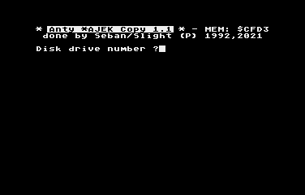

# ANTY *AJEK COPY

## The Story

This program is a copy program for Atari 8-bit computers, that reads files protected by "Speedy 2700 Turbo Loader". Speedy 2700 is format of storing files in a copy-protected form for a "Turbo 2000" compatible system. This software was used in '90 by traders of "pirate software". They often sell tapes for Atari 8-bit computers with games and other software that was protected by using the Speedy 2700 software. In their view, it was supposed to be a safeguard aimed at restricting competition.

As a young person unable to accept such an approach of these individuals, I decided to write a program that would reverse the operation of the Speedy 2700, enabling the transfer of files saved in this format to the original form. And that is why in 1992 `"Anty *AJEK Copy"` was created.



This program would probably never see the light of day and it would rot in the depths of my junk-yard, but after almost 30 years I found a tape recorded in this format, and when I was trying to read this very old tape, with software for 8-bit Atari computers, it turned out that one is using the Speedy 2700 format.

After a while, I remembered that a long time ago I wrote a program that allows you to read and restore such files, so I decided to use it again. However, it turned out that not all the files from this cassette can be copied correctly using my old software.

The software I developed as a teenager had some serious bugs that prevented all files from being restored correctly. Unfortunately, in 1992 I did not have enough test sets on which to check my code properly.

Years later, when I came across a cassette containing files in this format, I could understand what mistakes I made when writing the previous code. I don't know by what miracle, but the "Anti *AJEK Copy" sources survived all these years on my old floppy disks.

When I saw this code, I started to wonder if it was really my code :) It was so primitive and unreadable, that it could serve as a guide "you shouldn't write code this way" ;)

In 1992 I used the [MAC/65](https://en.wikipedia.org/wiki/MAC/65) Macro-Assember, and in my messy source code some numbers were written in the decimal system, some in the hexadecimal system, also I used 1-2 letter labels. I didn't use system variable names, I just referred to addresses directly. Writing code this way was very stupid thing, and now it appears as a real nightmare. Looking into it, after all those years, I had a big problem with understanding what is happening in this code. However, I decided to correct the mistakes and transfer the found files to the original Atari DOS format.

To do this, however, I had to decide whether to keep trying to fight MAC/65 or use cross-assembler. At first I tried to use a MAC/65 compatible cross-assembler called [OMC/65](https://github.com/pkali/omc65) but this one couldn't handle such sloppy code. So I decided to convert the sources to [XASM](https://github.com/pfusik/xasm) syntax.

I fixed what I could, shortened the code a bit, but did not bring it to the form that one would expect from a readable source. References to hardware registers and system locations (eg IOCB) are still in the form of direct references to addresses, so I think you can still show this code as an example of how not to write code ;]

However, after these 30 years, I decided to make these sources public. First of all, they contain procedures for reading data stored in Speedy 2700 format. Maybe one day, someone will want to be able to recover some files stored in Speedy 2700 format, and if it turns out that the program still contains errors, it will be possible to make corrections in it.

## How to use it

This software must be run from DOS on original hardware. It reads data stream from tape, and then it writes the file segments to disk in Atari binary DOS format. The "D:" device must be present, so that's DOS is necessary.

Using the emulator (with turbo tape support enabled) You can use this piece of software without DOS, but You must enable virtual hard-disk option, and allow Virtual "H:" device to act as "D:" device also.

The buffer for data depends on MEMLO value. the program uses the following areas to store data:

```txt
* from MEMLO to $B6FF
* from $C000 to $CFFF
* from $D800 to $FFFF
```

The cassette recorder must have an "Turbo System" upgrade installed. This software works with interfaces compatible with Turbo 2000F/2001 or AST or Turbo K.S.O. 2000 interfaces.

This program reads Speedy 2700 blocks directly, so You must skip the name header block, the loader block, and position the tape at first block of data written in Speedy 2700 format.

During reading the tape there can occur two type of errors:

```txt
Error #$8F means CRC error.
Error #$8C means pulse length error was detected
```

Both error indicates that the data on tape is probably corrupted and probably can't be recovered. You can try read the tape several times, clean tape head, or if You know what are You doing try to adjust the tape head.

## How to compile

You can user XASM or silimar syntax compatible cross-assember, for egzample [MADS](https://mads.atari8.info/).

If You are using XASM, just type:

```xasm antyajek.xsm -o antyajek.xex```

## Speedy 2700 data format

Speedy 2700 uses pulses that are compatible with Turbo2000F/2001/KSO formats, so:
* 1.00 ms pulse: sync/pilot tone
* 0.50 ms pulse: means logic "1"
* 0.25 ms pulse: means logic "0"

1st block stores the filename, so:

* $1000 (4096) sync-tone pulses
* $00,$FF bytes idicies filename block
* 10 bytes of filename
* CRC byte

2nd block stores the loader, this is plain 3072 bytes Turbo2000 block:

* $1000 (4096) sync-tone pulses
* Lo-Byte, Hi-Byte contains block length
* 3072 bytes of data
* CRC byte

Next blocks is stored in Speedy2700 format, and it's called "data blocks", the format of data-block is:

* $0600 (1536) sync-tone pulses
* lo-byte,hi-byte of block loading address
* lo-byte,hi-byte of block ending address
* CRC byte

the data-block is ended with one of two possible sequences:

* INIT-SEGMENT (block address is: $02E2-$02E3), then next two bytes (Lo,Hi) is INIT address 
* or $FF,$FF bytes that means End of File

If file have several data segments the stream is transmited constantly, but when INIT segment is present, then before next block, the sync-tone is present.

## License

This is free and unencumbered software released into the public domain.

Anyone is free to copy, modify, publish, use, compile, sell, or
distribute this software, either in source code form or as a compiled
binary, for any purpose, commercial or non-commercial, and by any
means.

In jurisdictions that recognize copyright laws, the author or authors
of this software dedicate any and all copyright interest in the
software to the public domain. We make this dedication for the benefit
of the public at large and to the detriment of our heirs and
successors. We intend this dedication to be an overt act of
relinquishment in perpetuity of all present and future rights to this
software under copyright law.

THE SOFTWARE IS PROVIDED "AS IS", WITHOUT WARRANTY OF ANY KIND,
EXPRESS OR IMPLIED, INCLUDING BUT NOT LIMITED TO THE WARRANTIES OF
MERCHANTABILITY, FITNESS FOR A PARTICULAR PURPOSE AND NONINFRINGEMENT.
IN NO EVENT SHALL THE AUTHORS BE LIABLE FOR ANY CLAIM, DAMAGES OR
OTHER LIABILITY, WHETHER IN AN ACTION OF CONTRACT, TORT OR OTHERWISE,
ARISING FROM, OUT OF OR IN CONNECTION WITH THE SOFTWARE OR THE USE OR
OTHER DEALINGS IN THE SOFTWARE.

For more information, please refer to <http://unlicense.org/>
